# OpenKBS — Fullstack Apps That Fit in One LLM Context

900 lines. Zero abstractions. The LLM reads your entire app in one pass, edits any file directly, and deploys with one command. No framework to learn — for you or for the AI.

```
functions/api/
  index.mjs                ← Router (30 lines)
  lib.mjs                  ← Shared utils: db, mqtt, storage (80 lines)
  modules/
    auth.mjs               ← Register, login, users
    posts.mjs              ← Create, list, delete posts
    messages.mjs           ← Private messaging

site/
  index.html               ← App shell (React + Tailwind CDN)
  api.js                   ← fetch wrapper (20 lines)
  modules/
    auth.jsx               ← Login/register forms
    posts.jsx              ← Feed, post card, compose
    messages.jsx           ← Chat panel

openkbs.json               ← One Lambda, one SPA
```

Total: ~900 lines. Every file is readable top to bottom. No abstractions to learn.

<p align="center">
  
</p>

---

## The idea

Every "best practice" in software architecture exists because humans have limited memory, work in teams, and are slow at refactoring. LLMs have none of these constraints.

| Human problem | Traditional solution | LLM reality |
|---|---|---|
| Can't hold entire codebase in memory | Decouple into independent modules | LLM reads everything in one pass |
| Teams need ownership boundaries | Events, contracts, interfaces | LLM owns everything |
| Modifying tested code is risky | Hooks, extension points, plugins | LLM modifies code directly and correctly |
| Slow at tracing call sites | Loose coupling, dependency injection | LLM traces all references instantly |
| Can't write correct SQL | ORMs, query builders | LLM writes better SQL than any ORM |
| Schema changes are error-prone | Migration frameworks | LLM writes perfect DDL |
| Need contracts between services | Event buses, typed schemas | LLM just imports and calls functions |

So this project inverts everything:

- **Couple freely.** Modules import from each other directly. The LLM updates all callers when something changes.
- **No events.** No hooks. No middleware. If module A needs to do something after module B, it calls B directly.
- **No ORM.** Raw SQL. The LLM writes it perfectly.
- **No migration framework.** `CREATE TABLE IF NOT EXISTS`. The LLM handles schema changes by editing the SQL.
- **No abstractions.** Each module is one file with everything: SQL, validation, business logic. Read top to bottom.
- **Copy-paste is fine.** Each module is self-contained. Shared code goes in lib.mjs. Everything else is intentionally local.

---

## Adding a new module

The LLM does three things:

### 1. Create backend: `functions/api/modules/todos.mjs`

```javascript
import { fail } from '../lib.mjs';

export const tables = `
    CREATE TABLE IF NOT EXISTS todos (
        id SERIAL PRIMARY KEY,
        user_id INTEGER NOT NULL,
        text TEXT NOT NULL,
        done BOOLEAN DEFAULT false,
        created_at TIMESTAMP DEFAULT NOW()
    );
`;

export const actions = {
    async addTodo({ userId, text }, db) {
        if (!userId || !text) fail(400, 'userId, text required');
        const r = await db.query(
            'INSERT INTO todos (user_id, text) VALUES ($1,$2) RETURNING *',
            [userId, text]
        );
        return { todo: r.rows[0] };
    },

    async listTodos({ userId }, db) {
        if (!userId) fail(400, 'userId required');
        const r = await db.query(
            'SELECT * FROM todos WHERE user_id=$1 ORDER BY created_at DESC',
            [userId]
        );
        return { todos: r.rows };
    },

    async toggleTodo({ todoId, userId }, db) {
        const r = await db.query(
            'UPDATE todos SET done = NOT done WHERE id=$1 AND user_id=$2 RETURNING *',
            [todoId, userId]
        );
        if (!r.rows.length) fail(404, 'Todo not found');
        return { todo: r.rows[0] };
    },
};
```

### 2. Register in router: `functions/api/index.mjs`

Add one import and one spread:

```javascript
import * as todos from './modules/todos.mjs';

const actions = Object.assign({},
    auth.actions,
    posts.actions,
    messages.actions,
    todos.actions,       // ← add this
);

const ready = initTables([auth, posts, messages, todos]);  // ← add todos
```

### 3. Create frontend: `site/modules/todos.jsx`

```jsx
function TodoList({ user }) {
    const [todos, setTodos] = React.useState([]);
    const [text, setText] = React.useState('');

    React.useEffect(() => {
        api('listTodos', { userId: user.id }).then(r => setTodos(r.todos));
    }, []);

    const add = async () => {
        if (!text.trim()) return;
        const { todo } = await api('addTodo', { userId: user.id, text });
        setTodos([todo, ...todos]);
        setText('');
    };

    const toggle = async (id) => {
        const { todo } = await api('toggleTodo', { todoId: id, userId: user.id });
        setTodos(todos.map(t => t.id === id ? todo : t));
    };

    return (
        <div className="space-y-3">
            <div className="flex gap-2">
                <input value={text} onChange={e => setText(e.target.value)}
                       onKeyDown={e => e.key === 'Enter' && add()}
                       placeholder="Add a todo..."
                       className="flex-1 px-4 py-2 rounded-lg border" />
                <button onClick={add} className="px-4 py-2 bg-blue-600 text-white rounded-lg">Add</button>
            </div>
            {todos.map(t => (
                <div key={t.id} onClick={() => toggle(t.id)}
                     className={`p-3 bg-white rounded-lg border cursor-pointer ${t.done ? 'line-through text-gray-400' : ''}`}>
                    {t.text}
                </div>
            ))}
        </div>
    );
}
```

Add to `site/index.html`:
```html
<script type="text/babel" src="modules/todos.jsx"></script>
```

Add a tab in the App component. Done.

---

## Cross-module calls

Modules just import from each other. No indirection.

```javascript
// messages.mjs needs user data from auth:
import { getUser } from './auth.mjs';

async sendMessage({ toUserId, ... }, db) {
    const recipient = await getUser(toUserId, db);   // ← direct function call
    await mqtt.publish(recipient.private_channel, 'new_message', msg);
}
```

If auth.mjs changes the `getUser` signature, the LLM updates messages.mjs. This takes milliseconds. No contracts, no interfaces, no event schemas needed.

<p align="center">
  
</p>

---

## Real-time (MQTT)

MQTT pushes data to the browser. That's its only job.

```javascript
// Backend: push to all browsers
await mqtt.publish('posts', 'new_post', { post });

// Backend: push to ONE user's browser
await mqtt.publish(user.private_channel, 'new_message', msg);

// Frontend: receive
mqttClient.on('message', (topic, payload) => {
    const msg = JSON.parse(payload.toString());
    if (msg.event === 'new_post') addToFeed(msg.data.post);
});
```

No subscriptions between Lambdas. No event buses. No IoT Rules. Just server → browser push.

---

## Why this works for vibecoding

The LLM reads the entire project — all 900 lines — in under a second. It understands every function, every table, every component. When you say "add bookmarks to posts", it:

1. Creates `modules/bookmarks.mjs` with a SQL table and three actions
2. Adds an import line in `index.mjs`
3. Creates `modules/bookmarks.jsx` with a BookmarkButton component
4. Adds a script tag in `index.html`
5. Maybe modifies `posts.jsx` to add the bookmark button to PostCard

Five file changes. Direct, coupled, simple. The LLM doesn't need events, hooks, or middleware to make this work. It just edits files.

That's the entire philosophy: **organize code so the LLM can find it, then let the LLM do what it's best at — reading and writing code.**
