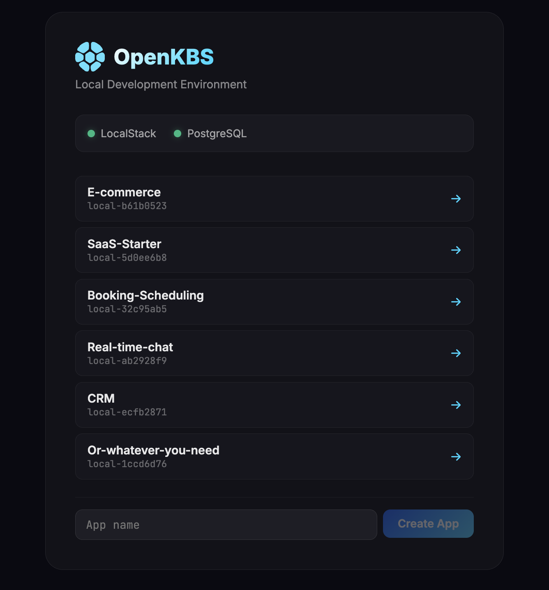

# OpenKBS

An open-source CLI that lets you build and deploy full-stack applications using Claude Code as your IDE. Write code locally, deploy functions, static sites, and databases — either to a **local environment** (LocalStack + PostgreSQL) or to the **OpenKBS cloud** (AWS Lambda, S3, CloudFront, Neon PostgreSQL).

Same code, same commands, two targets.

## Quick Start

### Prerequisites

- [Node.js](https://nodejs.org/) v20+
- [Docker](https://www.docker.com/)
- A [LocalStack](https://localstack.cloud/) auth token (free tier works)

### 1. Clone and install

```bash
git clone https://github.com/open-kbs/openkbs.git
cd openkbs
npm install
```

### 2. Configure LocalStack

```bash
cp .env.example .env
```

Edit `.env` and add your LocalStack auth token:

```
LOCALSTACK_AUTH_TOKEN=your-token-here
```

### 3. Start infrastructure

```bash
docker compose up -d
```

This starts:
- **LocalStack** (port 4566) — local AWS services (Lambda, S3, CloudWatch, EventBridge)
- **PostgreSQL** (port 5432) — local database

### 4. Launch the UI

```bash
npx tsx src/index.ts ui
```

Your browser opens `http://localhost:3000` with the development UI.



*The screenshot above shows example apps that can be built with OpenKBS. You start with a blank slate — create your first app from the UI.*

### 5. Build your app

From the UI:

1. **Create App** — enter a name, scaffolds a new project with React + Vite
2. **Install Dependencies** — installs npm packages
3. **Start Building** — launches Vite dev server with hot reload, opens your app in a new tab
4. **Deploy Locally** — deploys functions and site to LocalStack

Edit your code — the browser updates instantly via hot reload.

## Project Structure

When you create an app, it generates:

```
my-app/
├── src/                  # React source code (edit here)
│   ├── index.html
│   ├── main.jsx
│   └── App.jsx
├── build/                # Vite build output (auto-generated, deployed)
├── functions/            # Lambda functions (each folder = one endpoint)
│   └── api/
│       ├── index.mjs     # Handler: export const handler = async (event) => { ... }
│       └── package.json
├── openkbs.json          # Project config
├── vite.config.js        # Vite + API proxy config
└── package.json
```

## CLI Commands

### Functions

```bash
openkbs fn create <name>          # Scaffold a new function
openkbs fn deploy <name>          # Deploy a function
openkbs fn list                   # List deployed functions
openkbs fn invoke <name> -d '{}'  # Test a function
openkbs fn destroy <name>         # Delete a function
openkbs fn logs <name>            # View function logs
```

### Site

```bash
openkbs site deploy               # Deploy build/ to S3
```

### Storage

```bash
openkbs storage ls [prefix]       # List objects
openkbs storage upload <file>     # Upload a file
openkbs storage download <key>    # Download a file
openkbs storage rm <keys...>      # Delete objects
```

### Database

```bash
openkbs postgres info             # Show connection details
openkbs postgres connection       # Output connection string
```

### Deployment

```bash
openkbs deploy                    # Deploy all services from openkbs.json
```

### UI

```bash
openkbs ui                        # Start the local development UI
openkbs ui -p 8080                # Use a custom port
openkbs ui --no-open              # Don't auto-open browser
```

## Local vs Cloud

The `target` field in `openkbs.json` controls where deployments go:

| | Local | Cloud |
|---|---|---|
| **Functions** | LocalStack Lambda | AWS Lambda |
| **Storage** | LocalStack S3 | AWS S3 + CloudFront |
| **Database** | Docker PostgreSQL | Neon PostgreSQL |
| **Target** | `"target": "local"` | `"target": "cloud"` |

Apps created from the UI default to `"target": "local"`. To deploy to cloud:

```bash
openkbs login
# Change "target" to "cloud" in openkbs.json
openkbs deploy
```

## Environment Variables

Lambda functions automatically receive:

| Variable | Description |
|---|---|
| `DATABASE_URL` | PostgreSQL connection string |
| `STORAGE_BUCKET` | S3 bucket name |
| `OPENKBS_PROJECT_ID` | Project identifier |

## Development

To work on the CLI itself:

```bash
npm install
npm run dev -- <command>    # Run CLI in dev mode
npm run build               # Build ESM bundle
```

## License

MIT
